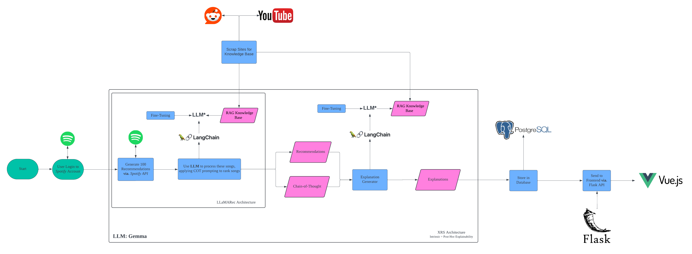

# XAI Music Recommender System

## Motivation
This project is an attempt at refining music recommendation systems (MRSs) by leveraging the capabilities of Large Language Models (LLMs). Traditional systems often leave out why certain recommendations are made, leaving users puzzled about their music queues. The project's goal aim is to not only generate more relevant, personalized recommendations but also provide clear, detailed explanations for each, merging the interpretability of XAI with the depth of understanding provided by LLMs. 

Despite the success of Spotify's MRSs like Discover Weekly and the Playlist Enhance feature, there' still a gap in variability and contextual relevance. This system will hopefully address these shortcomings by incorporating real-time cultural and internet trends.

## System Design

